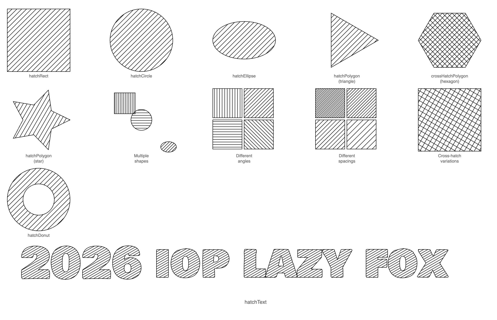
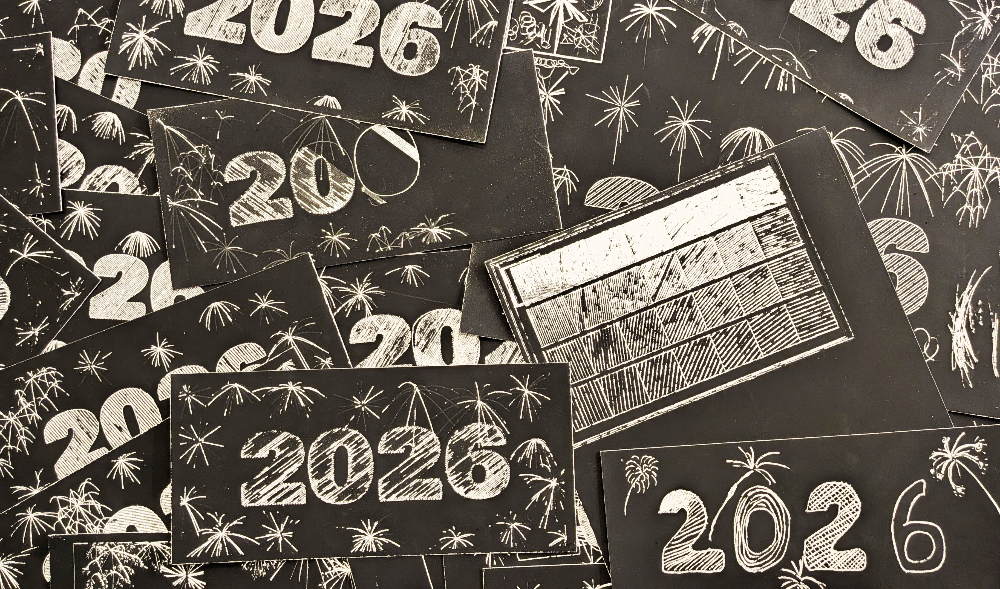
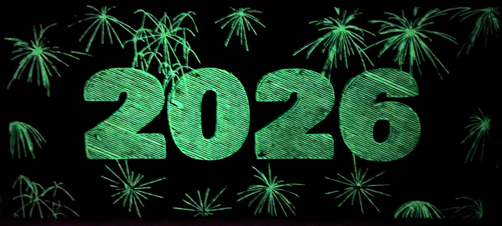

This year’s New Year’s cards turned into quite the experiment. I pulled out my plotter again, but instead of the usual pen on paper, I went for scratch cards — the kind with a black coating that hides a surprise underneath.

Before diving into the mechanical setup, I worked on the design phase. In the center of each card I wanted a bold 2026, surrounded by fireworks. I had an AI model generate a couple of different firework types to explore complexity and shapes until I found a few that worked well for plotting.

*a few AI‑generated fireworks designs with different styles*

Then came the numbers. To give the “2026” some texture, I also relied on an AI model to generate a custom hatching library — a whole collection of line‑based fills that could be plotted.

*A couple of shapes to check if the hatching library works as expected*

Once the design was ready, the real hardware tinkering began. Scratch paper posed its own challenges: the small wooden stylus that came in the kit didn’t even make a dent when mounted in the plotter. I improvised, experimenting with a drill bit, a large screw, and even added weights to get better contact pressure.

*a close‑up of the plotter with the improvised scratching tool mounted.*

The first version of the plot took a painstaking 30 minutes to complete. By simplifying the fireworks and cleaning up overlapping lines, I eventually cut that down to around 15 minutes per card — still long, but much more reasonable.

In the end, the results weren’t perfect. Some lines didn’t scratch cleanly, and a few designs came out patchy or misaligned. I suspect it had something to do with the scratch paper coating or the direction of the screw in the plotter.

*A pile of tests and failures*

But despite the imperfections, I sincerely hope that someone at home switched off the lights and had a delightful surprise in the dark. If not, maybe the hint at the back of the card will light a spark with someone:

“Een stralend jaar toegewenst” — wishing you a bright year.

