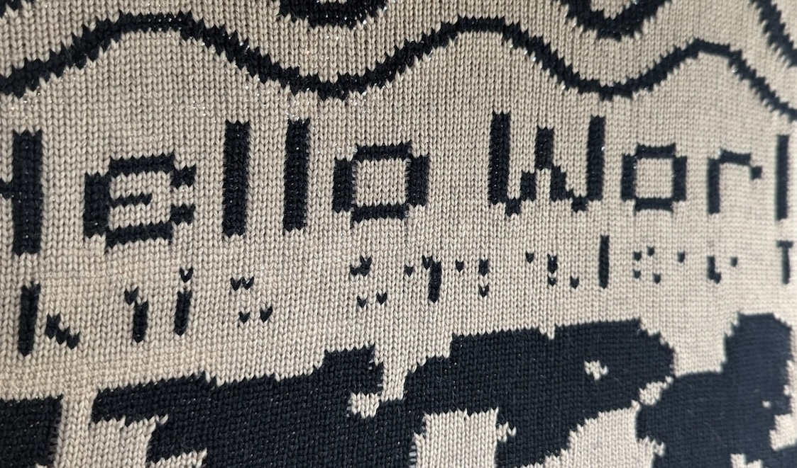
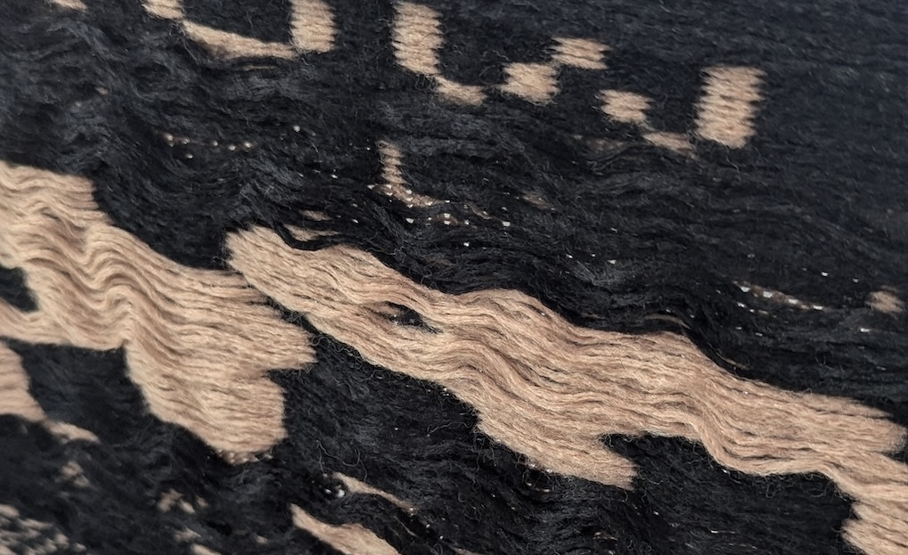
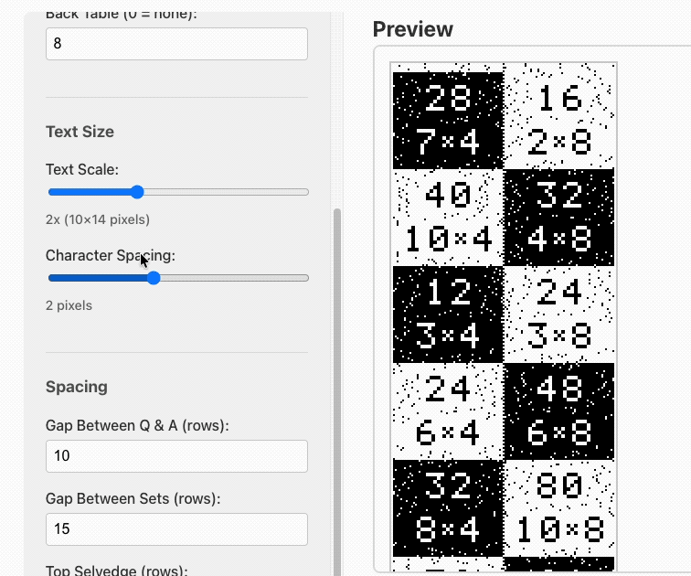
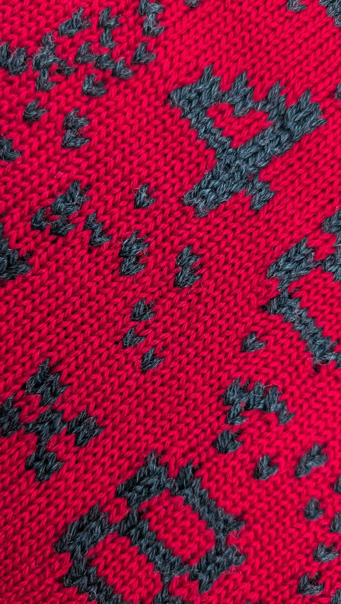
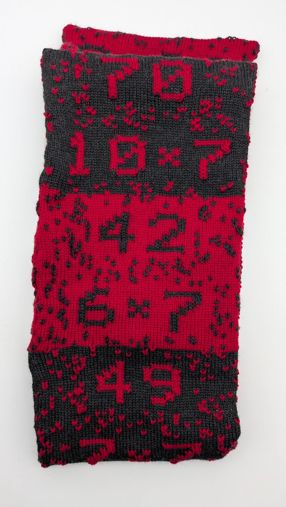

I have a soft spot for machines that bring something out of the digital world, right in the physical world. I like how they translate from a pixel-perfect, double-precision world, to our imperfect physical world. But let us call them happy accidents, opportunities. One is able to create almost everything digital and the fact that you can multiply this by all kinds of material, just broadens our possibilities.

It must have been via [Make:](https://makezine.com/article/craft/how-to_hacking_the_brother_kh/) back in the days that I first got to know that one could hack a knitting machine. I watched [the video](https://www.youtube.com/watch?v=vKpdFIlbqSY) a couple of times and I always kept remembering it at the back of my head. Printing with yarn? Yes please!

I was always on the lookout for one of those on a flea market. Meanwhile, the [AYAB (All Yarns Are Beautiful)](https://www.ayab-knitting.com/) project was born. They raised the hacking part to another level by providing the components to create an Arduino Hat. You simply need to swap the inner computer of the knitting machine with those new Arduino brains and connect it to your computer. Doing so, your computer can control the position of the needles, based on a provided bitmap. You can knit forever.

So a couple of years ago, I finally found a decent second hand offer and took the bait. And it was... difficult. I had no knitting experience. Even without the hack, those things aren't plug and play. But with the manual and the AYAB documentation, I was able to create some tests.

*The mandatory 'Hello World'*

I never really made anything worth mentioning with it. Part of it because of the backside of the knitted piece: that is full of loose yarn, the so called floats. It seemed inevitable with my type of setup.

*The floats on the back*

## And then it hits me

At the moment, it's all multiplication tables ('maaltafels' in Dutch) here at home. And suddenly, I was riding my bike, the wordplay 'sjaaltafel' came to me. ('sjaal' -> scarf, 'tafel' -> table) It stuck to me and I thought it would be fun to practice multiplication tables through a scarf. First you would have to roll the entire thing up, by unrolling you would see a multiplication, by further unrolling you would see the result, and so on and on.

## With a little help

I want to pause for a moment on how I created the design, or *created something that can create the design*. I discussed the idea —typing while walking— with Gemini on my mobile phone. I wanted a tool that would let me change parameters like sizes, padding, table selection etc. I asked if it would be possible to do something about the floating on the back. There was no straight solution for this, but the best alternative was to make the scarf double as wide, fold it in the middle and sew the 2 loose sides together. This way the floats are tucked away inside the scarf. It even showed me some pictures on how to manually sew it together. Fine for me. I still asked to add some random dots on it, simply to make the floats a bit more manageable.

Then, I asked it to create technical instructions on how to create a tool that let me generate those designs, so I could pass it to another coding model. I handed that over to Copilot that was running in the cloud on a fresh repository. Once I got home, the whole thing was up and running. Was it perfect? No, but surely good enough.

*This way I was able to quickly make adjustments to the design*

## The final touches, a lot of them

And here we have it. A finished sjaaltafel. It took me quite some time to manually sew everything by hand, but with some skilled advice from my relatives, I made it. It's not perfect, but I'm happy with the result, up to the next one!

